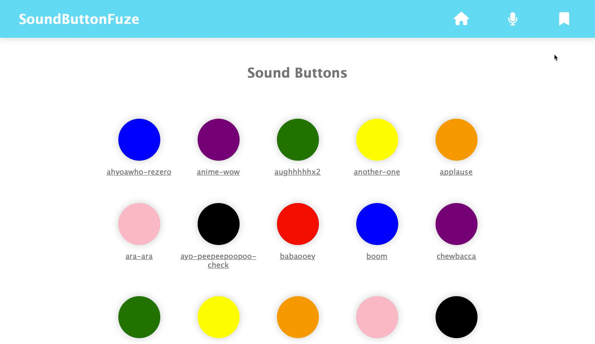

# SoundButtonFuze

A full stack JavaScript solo project for people who want to listen and record sounds at a click of a button

## Why I Built This

As a fan of sound effects, I wanted to build an application that would let me listen to and record new sound effects.

## Live Demo
Try the application live at https://sound-button-fuze.eugenepark.dev/

## Technologies Used

  * React
  * PostgreSQL
  * Node.JS
  * JavaScript - ES6
  * HTML5
  * CSS3
  * Webpack
  * Dokku
  * npm - mic-recorder-to-mp3
     * https://www.npmjs.com/package/mic-recorder-to-mp3?activeTab=readme

## Features

  * Users can click on buttons and listen to correlating sound
  * Users can sign-in/sign-up
  * Users can record sounds
  * User can view sound oscillator while recording
  * User can listen to their recorded sound before submitting
  * User can name their recorded sounds
  * User can submit and view recorded sound on homepage
  * User can view bookmarked sounds

## Stretch Feature

  * User can bookmark sounds
  * User can play a medley of their bookmarked sounds
  * User can upload and set an image for their recorded sound

## Preview

